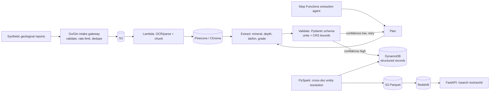

# Architecture

## Data flow notes

- The intake gateway is the only synchronous hop before expensive OCR/embedding work — its job is to reject junk cheaply.
- `Validate` enforces the domain schema (units, coordinate bounds) independently of the confidence score — a record can have high extraction confidence and still fail validation if, say, a coordinate falls outside plausible bounds.
- Entity resolution across documents (the same mineral occurrence reported in two different surveys) happens only in the batch PySpark step, not per-document.
