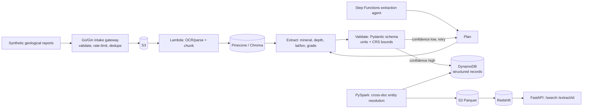

# Architecture

## ASCII — execution flow

```
  synthetic/public geological reports
             |
             v
  src/ingestion/gateway (Go/Gin intake gateway)
    validate, dedupe by content hash
             |
             v
           S3 (geo-docs)
             |
             v
  src/ingestion/index_docs.py
    noisy-text chunking + embeddings
             |
             v
     Pinecone / Chroma
             |
             v
  src/orchestration/statemachine.py  -- drives --> src/models/extraction_agent.py
    (extraction stays in Python here — an LLM call doesn't fit a
     bare Lambda runtime)
             |
      +------+---------------------------------------+
      |                                               |
      v                                               |
  Plan --> Extract (mineral, depth_m, lat/lon, grade)   |
      |                                               |
      v                                               |
  Validate: Pydantic domain schema (units, CRS bounds)   |
      |                                               |
      v                                               |
  Gate (Lambda): src/orchestration/lambdas/check_attempt.py
    atomic retry-attempt counter
      |
   +--+------------------------+
   |                           |
 confidence high          confidence low
   |                           |
   v                           v
 DynamoDB                 retry with narrowed query  --------+
 (structured records)       (back to Plan, until MAX_ITERATIONS)
   |
   v
  src/transformation/resolve.py (PySpark)
    cross-document entity resolution
             |
             v
        S3 Parquet
             |
             v
  src/utils/warehouse.py :: DuckDB (Redshift stand-in)
             |
             v
  src/serving/api.py :: FastAPI
    /search   /extract/{doc_id}
```

## Mermaid (same flow)



## Data flow notes

- The intake gateway is the only synchronous hop before expensive OCR/embedding work — its job is to reject junk cheaply.
- `Validate` enforces the domain schema (units, coordinate bounds) independently of the confidence score — a record can have high extraction confidence and still fail validation if, say, a coordinate falls outside plausible bounds.
- Entity resolution across documents (the same mineral occurrence reported in two different surveys) happens only in the batch PySpark step, not per-document.
